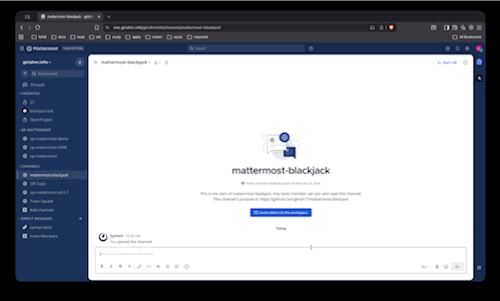

# mattermost-blackjack

A simplified Blackjack game for [Mattermost](https://mattermost.org). It doesn't involve any stakes or betting. Allows single player mode. The objective is to get a [Blackjack](https://en.wikipedia.org/wiki/Blackjack).
Supports only `hit` and `stay` player decisions. Cards from a single deck of 52 cards is dealt during each game.

## Demo



## Installation

* Download the plugin [here](https://github.com/girish17/mattermost-blackjack/releases/download/v1.1.1/com.girishm.mattermost-blackjack-1.1.1.tar.gz)
* Go to Mattermost System Console
* Under Plugins, choose Upload Plugin and select the downloaded file
* Enable the Blackjack plugin and try `/blackjack` command in a channel

## Project Setup

### Prerequisites

- Go 1.18+
- Node.js 16+ (for webapp)
- NPM
- Mattermost development server (for deployment)

### Install Dependencies

```bash
cd webapp
npm install
cd ..
go mod download
```

## Development

### Running Tests

Run all tests:
```bash
make test
```

Run server tests only:
```bash
go test -v ./server/...
```

Generate coverage report:
```bash
make coverage
```

### Building the Plugin

Build for all platforms:
```bash
make dist
```

Build for current platform only:
```bash
make server
make bundle
```

### Deploying to Mattermost

Deploy to a local Mattermost server:
```bash
make deploy
```

Enable the plugin:
```bash
make enable
```

### Code Style

Check code style:
```bash
make check-style
```

### Development Resources

* To manually build and deploy this plugin on Mattermost server, follow this [document](https://developers.mattermost.com/extend/plugins/developer-setup/)

## Available Make Targets

| Target | Description |
|--------|-------------|
| `make all` | Checks style, tests, builds and bundles the plugin |
| `make check-style` | Runs eslint and golangci-lint |
| `make server` | Builds the server for all supported architectures |
| `make webapp` | Builds the webapp |
| `make bundle` | Generates a tar bundle of the plugin |
| `make dist` | Builds and bundles the plugin |
| `make deploy` | Builds and installs the plugin to a server |
| `make test` | Runs all unit tests |
| `make coverage` | Generates a coverage report |
| `make clean` | Removes all build artifacts |
| `make enable` | Enables the plugin on the server |
| `make disable` | Disables the plugin on the server |
| `make reset` | Resets the plugin (disables and re-enables) |
